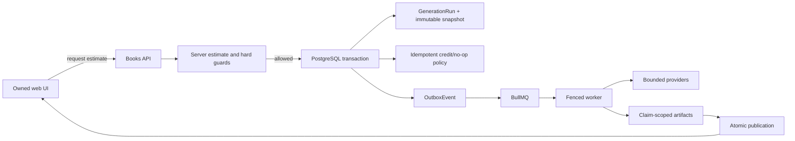
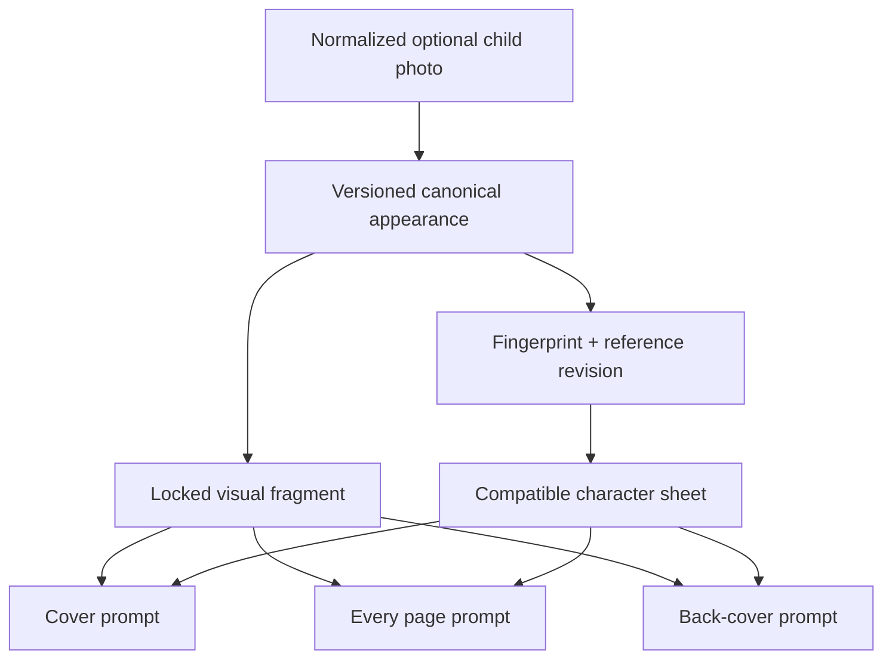
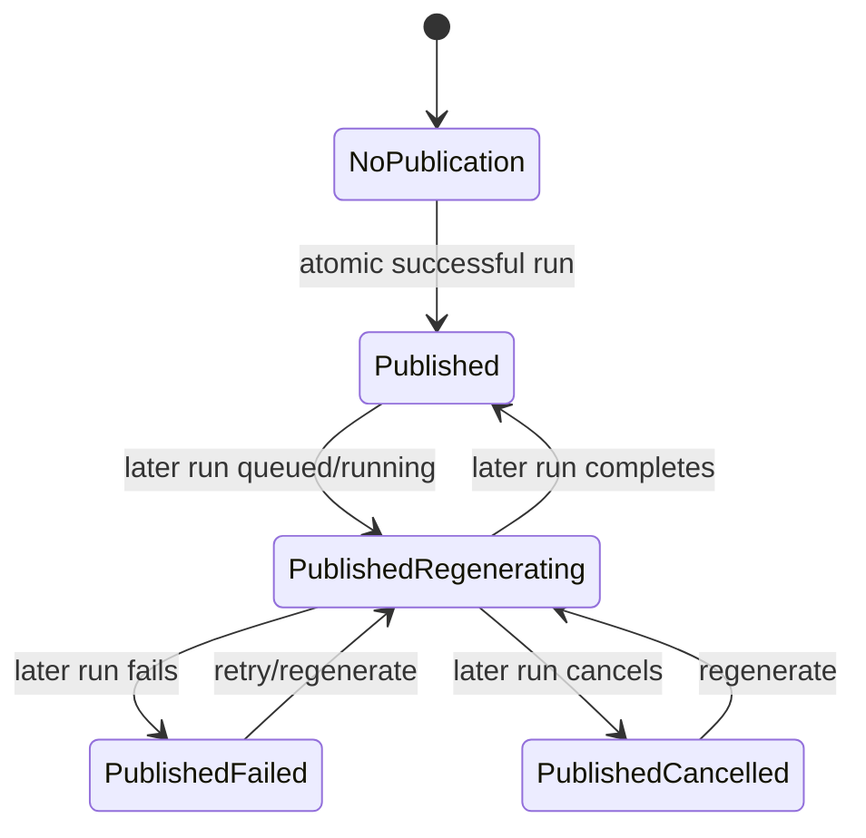

# Phase 7 Implementation Plan

## Scope and evidence

This plan is derived from the repository at the start of Phase 7. The current implementation, its
tests, `docs/CURRENT_PRODUCT.md`, and the Prisma migration history were inspected. Code and tests
take precedence over historical design documents.

The phase is intentionally incremental. It retains the existing deterministic orchestrator,
`GenerationRun`, transactional outbox, BullMQ worker, immutable input snapshots, claim leases and
fencing, idempotent credit/refund operations, bounded repair, claim-scoped storage, and atomic
publication.

## Current behavior and audit findings

### Privacy and archive hygiene

- `.gitignore` already excludes environment files other than `.env.example`, dependency trees,
  build/cache output, `tmp`, local database files, logs, Playwright output, MinIO data, and clean
  archive output.
- `.dockerignore` already excludes environment files, local/private runtime directories, PDFs,
  common image formats, databases, build output, and archives from Docker build contexts.
- `scripts/archive-clean.mjs` walks without following symbolic links, classifies entries by path
  without reading excluded file contents, copies only allowed files to a temporary staging
  directory, and removes only its own staging directory.
- The archive filter does not yet cover every required nested form. In particular, `.docker-data`,
  common Postgres/Redis data directory names, `build`, Playwright/test report directories, log
  directories, and several less common photo formats need explicit coverage.
- Existing archive tests exercise the path classifier and fail-closed assertion, but not a nested
  filesystem traversal containing unsafe fixtures.

### Product and billing mode

- There is no explicit product mode. API auth defaults safely to JWT; web/API auth modes are
  documented as a required pair but are configured independently.
- Stripe billing is already behind `STRIPE_BILLING_ENABLED=false` by default. The frontend still
  renders credit balance and purchase wording even when Stripe is unavailable.
- `BookGenerationService.createRunAndSchedule` currently debits one credit inside the same
  transaction that creates the run and outbox event. Generation admission also enforces
  concurrent, rolling-user, global-circuit, image-count, and paid-provider-call budgets.
- Cancellation/failure refunds are idempotent and keyed to the generation run.

### Publication availability

- `GenerationRunCoordinator` and publication stages preserve the last successful `Book`
  publication fields while a later run changes workflow status.
- `BookDto` exposes actual publication metadata through `previewPdfUrl`, `bookPreview`,
  `bookLayout`, and published image identifiers.
- `book-detail-view.tsx` renders `PublishedBookReader` only when the current workflow status is
  `complete`. `PdfSection` partly handles a cancelled regeneration but still couples most
  availability to workflow status.

### Book detail structure

- `book-detail-view.tsx` is currently about 900 source lines and mixes status/header rendering,
  generation controls, draft diagnostics, published reading, PDF controls, page text editing,
  page image regeneration, and deletion.
- `page.test.tsx` is about 2,700 lines and covers composition, polling, races, confirmation,
  credits, errors, and the page revision flows.
- `use-book-detail.ts` already owns server polling and should remain the single server-state
  boundary.

### Mock language support

- `SupportedLanguage` and draft validation allow `en`, `ru`, and `pl`.
- The mock story provider contains deterministic English and Russian content. Polish takes the
  English fallback path.
- The mock provider already produces title/content, character card, story/page plans,
  illustration descriptions, cover/back-cover plans, and integrates the requested educational
  message. No external call is needed for this slice.

### Provider budgets and estimates

- Scheduling already rejects real image plans above `MAX_GENERATED_IMAGES_PER_BOOK` and real paid
  call plans above `MAX_PAID_PROVIDER_CALLS_PER_RUN` before creating a run or charging.
- `GenerationProviderTelemetry` centrally records logical calls, prompt hashes, configured
  per-operation cost estimates, and actual logical call count. HTTP retries remain provider
  internals.
- The current preflight count is a worst-case full-run count. It does not return a server-owned
  estimate DTO, duration range, cost range, or retry/resume-aware new-work count.
- Page image regeneration has a separate server-owned one-credit quote and confirmation flow and
  will remain separate.

### Character consistency

- The current flow builds a safe stylized `CharacterProfile`, optionally creates a character
  sheet, and inserts `consistencyPrompt` into cover/page/back-cover prompts.
- The profile is not yet a formal versioned canonical appearance object and has no fingerprint
  tied to the reference asset revision.
- Resume currently validates claim-scoped bytes and input resumability, but compatibility is not
  expressed as character fingerprint equality.

### Prisma schema

- `Upload`, `CharacterCard`, `BookSeries`, `WizardDraft`, `ShareLink`, `Subscription`,
  `UserBookState`, and `Notification` exist in the initial schema/migration.
- Their relations create foreign-key and deployed-data risk even where no runtime Prisma delegate
  is found.
- `ChildProfile` and `BookPage` remain relevant to private-family reuse and page revision work and
  are explicitly outside any opportunistic removal.
- No destructive migration will be created without repository proof plus deployed-data evidence.

## Planned changes by slice

### Hygiene prerequisite

Exact files:

- `.gitignore`
- `scripts/archive-clean.mjs`
- `scripts/archive-clean.test.mjs`
- `README.md`
- `docs/local-demo.md`

Add nested unsafe-directory and private-file coverage, plus traversal-based tests. The documented
review command will be only `pnpm archive:clean`.

### Slice 7A: local-family product mode

Exact files expected:

- `.env.example`
- `apps/web/.env.example`
- `apps/api/src/config/env.schema.ts`
- `apps/api/src/config/env.schema.spec.ts`
- `apps/api/src/books/book-generation.service.ts`
- `apps/api/src/books/book-generation.service.spec.ts`
- `apps/api/src/credits/credits.service.ts` and its tests only if a zero-charge ledger helper is
  needed
- `apps/web/scripts/check-build-env.js`
- `apps/web/src/lib/product-mode.ts` and tests
- `apps/web/src/app/dashboard/layout.tsx` and tests
- `apps/web/src/app/dashboard/credits/page.tsx` and tests
- generation wording in `apps/web/src/app/dashboard/books/[id]/`

`PRODUCT_MODE` and `NEXT_PUBLIC_PRODUCT_MODE` will accept only `home | demo` and default to
`home`. API validation will reject a supplied mismatched public mode; the web build check will
reject a supplied server/public mismatch in a shared deployment environment. Home mode will keep
generation quotas and provider budgets while making the generation charge zero/no-op through the
existing transactional boundary. Demo mode will preserve the current paid-credit and Stripe
behavior.

### Slice 7B: publication availability

Exact files expected:

- `apps/web/src/app/dashboard/books/[id]/book-detail-view.tsx`
- extracted publication/status components from Slice 7C
- `apps/web/src/app/dashboard/books/[id]/page.test.tsx` or split successor tests
- `apps/web/e2e/storyme.smoke.spec.ts`

Introduce one pure publication-availability predicate based on coherent published artifact
metadata, not `Book.status`. Keep the reader and PDF controls available for a prior publication
during queued/running/failed/cancelled regeneration. Show a non-blocking version-generation
message while the workflow is active or ended unsuccessfully.

### Slice 7C: split book detail UI

Exact files expected:

- `apps/web/src/app/dashboard/books/[id]/book-detail-view.tsx`
- `apps/web/src/app/dashboard/books/[id]/components/*`
- `apps/web/src/app/dashboard/books/[id]/hooks/*`
- `apps/web/src/app/dashboard/books/[id]/*.test.tsx`

The view remains the composition root. `use-book-detail.ts` remains the owner of fetched book,
progress, and diagnostics state. Local mutation state moves into focused hooks for generation
actions, page text editing, and page image revision. Components receive data/actions without
copying server objects into a second store. Diagnostics stay opt-in and isolated.

### Slice 7D: deterministic Polish mock content

Exact files expected:

- `apps/api/src/agent/story-generation-provider.ts`
- `apps/api/src/agent/story-generation-provider.spec.ts`
- related quality/layout tests only where Polish-specific assertions belong

Add deterministic Polish templates for every mock output field, including the lesson/dedication
and cover/back-cover copy. Keep strings within current Zod/layout limits and leave OpenAI prompt
and response behavior unchanged.

### Slice 7E: estimate and hard budget

Exact files expected:

- `.env.example`
- `packages/types/src/agent.types.ts` or `book.types.ts`
- `apps/api/src/agent/generation-provider-telemetry.ts` and tests
- a focused `apps/api/src/agent/generation-estimate.ts` and tests
- `apps/api/src/config/env.schema.ts` and tests
- `apps/api/src/books/book-generation.service.ts` and tests
- `apps/api/src/books/books.controller.ts` and tests
- `apps/web/src/lib/api/books.ts` and tests
- generation action UI/tests under the book detail directory

The estimate is built from the immutable candidate input and provider selection. It reports story,
character-profile, image, optional repair, maximum calls, optional estimated cost range, and
optional duration range. Mock reports zero external calls/cost. Retry estimates inspect reusable
compatible artifacts and count only missing work. The hard guards
`REAL_GENERATION_MAX_PROVIDER_CALLS_PER_RUN`,
`REAL_GENERATION_MAX_IMAGES_PER_RUN`, and
`REAL_GENERATION_MAX_ESTIMATED_COST_USD` execute before the transactional charge/schedule
boundary. Existing aliases may remain temporarily for rollback compatibility.

### Slice 7F: canonical character consistency

Exact files expected:

- `packages/types/src/book.types.ts`
- `apps/api/src/books/books.schemas.ts`
- `apps/api/src/agent/character-profile-provider.ts` and tests
- `apps/api/src/agent/character-reference.stage.ts` and tests
- `apps/api/src/agent/story-generation-provider.ts` and tests
- `apps/api/src/agent/generation-resume.service.ts` and tests
- `apps/api/src/agent/agent.service.ts` and focused tests

Define a versioned, canonical, non-sensitive appearance object with stable field ordering and a
SHA-256 fingerprint over canonical appearance plus reference asset revision. Build one locked
visual fragment and safe negative constraints once, then reuse it verbatim in every illustration
description. Character-sheet reuse requires fingerprint equality in addition to valid bytes.
Legacy profiles degrade to regeneration rather than unsafe reuse.

### Slice 7G: schema/status audit

Exact files:

- `docs/PHASE_7_SCHEMA_AUDIT.md`

The decision table will record runtime delegate searches, reverse relations/foreign keys,
migration/deployed-data risk, recommendation, ordered migration prerequisites, and rollback.
Unreachable enum values will be mapped against writes, comparisons, DTO mapping, diagnostics, and
migration history. No destructive migration is planned from repository evidence alone.

## Data flow

## Invariants

- `GenerationRun` remains the execution source of truth; `Book.status` is a workflow mirror, not a
  publication predicate.
- Run creation, book transition, charge policy, and outbox insertion remain one database
  transaction.
- Every worker mutation remains guarded by run id and fencing version.
- Retry uses the prior immutable snapshot; regenerate captures current owned draft input.
- Only a fully rendered claim can atomically replace published pointers.
- A later failure/cancellation cannot clear a prior publication.
- Home mode does not relax authentication, ownership, provider budgets, concurrency quotas,
  cancellation fencing, or deletion confirmation.
- No diagnostics or archive process reads/logs private photo, generated image, or PDF contents.
- Page image regeneration retains its own quote/confirmation boundary.
- Character descriptions remain stylized and non-identifying; no sensitive-attribute inference or
  biometric claim is introduced.

## Migration risk

No schema migration is required for the planned product mode, publication UI, Polish mock,
estimate, or character-profile JSON evolution. Character JSON schemas must accept legacy rows and
force incompatible character-sheet regeneration. Removing existing Prisma models or enum values
would be destructive and is deferred pending deployed-data inspection and a separately approved
migration.

## Test plan

After each slice, run its focused Vitest/Jest tests and typecheck affected packages. Coverage will
include:

- real nested traversal exclusion for secrets, temporary/private media, PDF/database/data dirs,
  reports, logs, build output, and previous archives;
- product-mode defaults, mismatch rejection, home UI, demo UI, and charge/no-charge transaction;
- publication with complete, running regeneration, failed regeneration, cancelled regeneration,
  and failed initial generation states;
- component/hook behavior for loading, races, cancellation, retry, confirmations, credits, and
  errors;
- deterministic `en`, `ru`, and `pl` mock outputs and Unicode;
- estimate boundary values, zero-cost mock, retry reuse, and hard-limit rejection before charge;
- stable canonical fingerprints, meaningful revision changes, locked-fragment propagation, and
  compatible/incompatible reuse.

At completion run the exact validation commands required by the Phase 7 brief. Playwright runs use
disposable mock data only when PostgreSQL and Redis are available.

## Rollback plan

- Each slice is kept as a bounded commit/change set and can be reverted independently.
- `demo` mode preserves the current credit/Stripe behavior and is the operational rollback for
  product-mode presentation.
- Existing budget environment names remain usable during any estimate-variable transition.
- Publication UI changes do not mutate publication storage and can be rolled back independently.
- Extracted UI modules preserve public component/API contracts, allowing a mechanical revert.
- New Polish templates affect only the mock provider.
- Versioned character JSON retains legacy parsing; incompatible legacy rows regenerate derived
  artifacts rather than requiring a database rollback.
- No destructive Prisma rollback is necessary because Phase 7G is documentation-only unless
  separately proven and approved.
